## Task 1: Temperature Converter

## Task 2: Salary Calculator

## Task 3: Triangle Angle Finder

## Task 4: Simple Grade Calculator
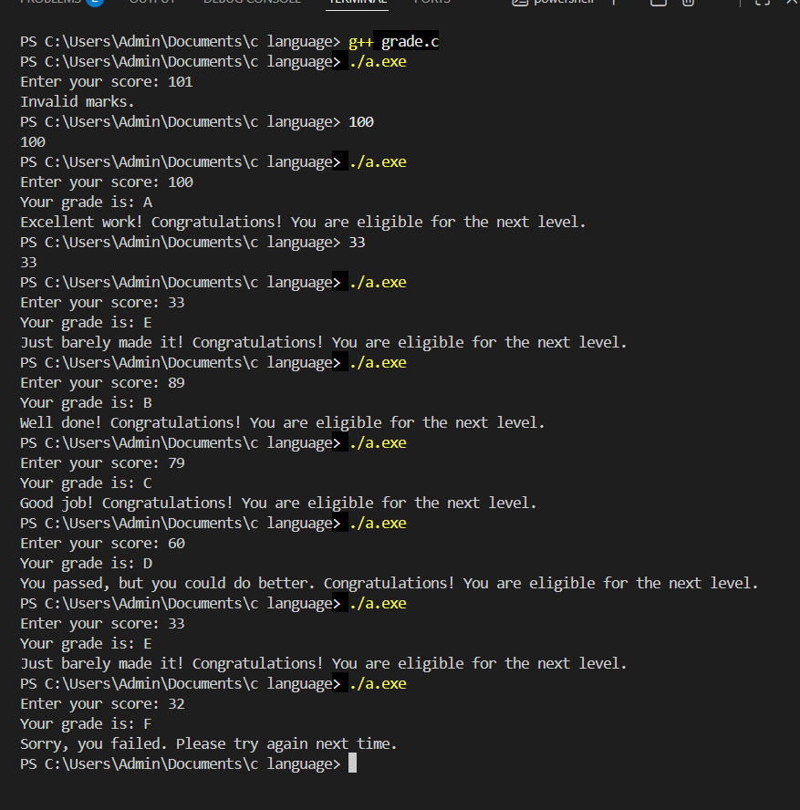

## Alphabet skipper
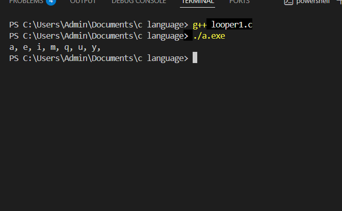

## Digit counter
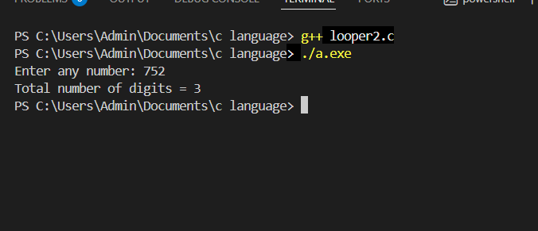

## Digit Addition
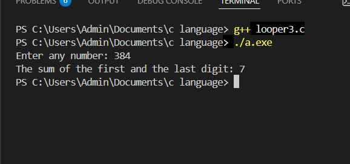

## pattern 1
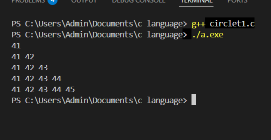

## pattern 2
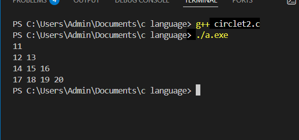

## pattern 3
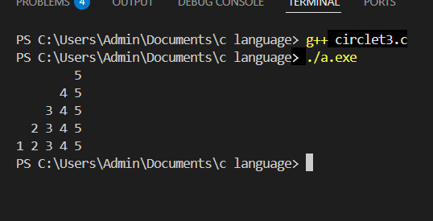

## pattern 4
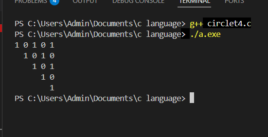

## pattern 5
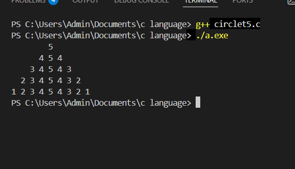

## pattern 6
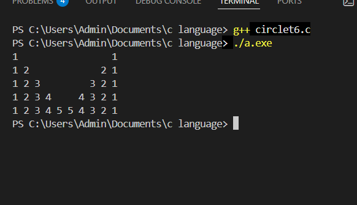

## pattern 7
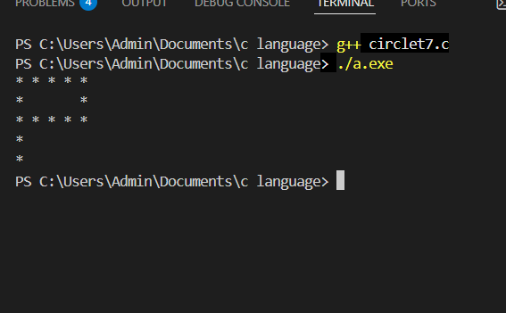

## palindrome
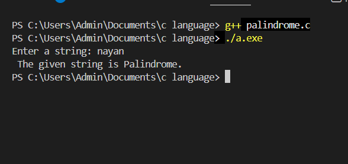

## frequency
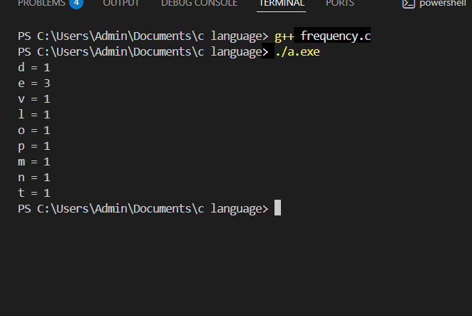
